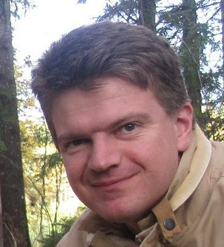

<!-- font: frutiger -->

# Machine Learning (ST5401), 7.5 credits

---

## Introduction and aims

In this course you will learn how to formulate and organize practical machine learning problems, identify and estimate appropriate machine learning models for prediction and clustering, evaluate and select among different machine learning models and algorithms and implement machine learning models and algorithms in a programming language.

The course gives you knowledge about machine learning that is used within marketing, finance, economics, textual analysis, digital humanities and social scienses. You will encounter many different forms of data, including images and text.

The course covers a number of machine learning methods with a focus on prediction. The course deals with supervised and unsupervised machine learning as well as semi-supervised and active learning. The course includes flexible regression and classification, regularization, methods for predictive model performance evaluation, Gaussian processes, clustering algorithms and mixture models.

---

## Lecturers

\
[Mattias Villani](https://mattiasvillani.com) \
Professor of Statistics, Stockholm and Linköping University\
Probabilistic machine learning and Bayesian methods

\
[Frank Miller](http://www.adoptdesign.de/frankmillereu/) \
Professor of Statistics, Stockholm University \
Experimental design, active learning and optimization methods

## Computer lab assistant

\
[Karl Sigfrid](https://www.su.se/english/profiles/kasi3175-1.513541) \
PhD student in Statistics, Stockholm University 

---
## Course description

The formal course description document with all the details about grading etc is [here](Misc/CourseDescriptionML.pdf).

## Course literature

The course will use the following book as the main course literature:

* **Machine Learning - a first course for engineers and scientists** (MLES) by Lindholm et al. (2021). Forthcoming at Cambridge University Press. Draft version available [here](http://smlbook.org/book/sml-book-draft-latest.pdf). The previous title of the book was 'Supervised Machine Learning'.
* Additional course material linked from this page, such as articles and tutorials.
--- 

## Schedule

The course schedule on TimeEdit is here: [Schedule](https://cloud.timeedit.net/su/web/stud1/s.html?i=x7QeQ39x4nnyknbcQanQ6clvl1Z2ZZ0c02ndhcn_seXlYy603w575wgZuQnY).

---
## Lectures (preliminary)

**Lecture 1 - Introduction, k-NN and decision trees**\
Reading: MLES 1-2 |  [Slides](TBA) \
Code: 

**Lecture 2 - Regularized non-linear regression and classification**\
Reading: MLES 3 |  [Slides](TBA) \
Code: 

**Lecture 3 - Evaluating predictive performance and hyperparameter learning**\
Reading: MLES 4 |  [Slides](TBA) \
Code: 

**Lecture 4 - Ensemble methods**\
Reading: MLES 7 |  [Slides](TBA) \
Code:

**Lecture 5 - Learning from large-scale data**\
Reading: MLES 5 |  [Slides](TBA) \
Code: 

**Lecture 6 - Neural networks**\
Reading: MLES 6.1-6.2 |  [Slides](TBA) \
Code:  

**Lecture 7 - Image data and convolutional neural networks**\
Reading: MLES 6.3-6.4 |  [Slides](TBA) \
Code: 

**Lecture 8 - Gaussian process regression and classification**\
Reading: MLES 9 |  [Slides](TBA) \
Code:  

**Lecture 9 - Clustering and mixture models for unsupervised learning**\
Reading: MLES 10.1-10.3 |  [Slides](TBA) \
Code: 

**Lecture 10 - Textual data and topic models**\
Reading: [Multinomial-Dirichlet analysis](Literature/MultinomialDirichlet.pdf) | [Topic models intro](http://www.cs.columbia.edu/~blei/papers/Blei2012.pdf) | [Slides](TBA) \
Code: 

**Lecture 11 - Semi-supervised learning**\
Reading: MLES 11.2 |  [Slides](TBA) \
Code: 

**Lecture 12 - Active learning**\
Reading: TBD |  [Slides](TBA) \
Code: 

---
## Computer labs

* The three computer labs are central to the course. Expect to allocate substantial time for each lab. Many of the exam questions will be computer based, so working on the labs will also help you with the exam.

* R will be used as the course's programming language, see below for more info.

* The labs should be done in pairs of students.

* Each lab report should be submitted as a PDF along with the .R file with code. Submission is done through Athena.

* There is four hours of computer lab time allocated to each lab. The idea is that you: 
  * should start working on the lab before the computer session
  * so that you are in a position to ask questions at the session
  * and then finish up the report after the lab session.

**Computer Lab 1** - Regularized nonlinear regression and classification.\
Lab 1a - Regularized regression: [R notebook](/Labs/Lab1a.Rmd) | [pdf version](/Labs/Lab1a.pdf) | [html version](/Labs/Lab1a.html) \
Lab 1b - Regularized classification: [R notebook](/Labs/Lab1b.Rmd) | [pdf version](/Labs/Lab1b.pdf) | [html version](/Labs/Lab1b.html) \
Submission: Athena.

**Computer Lab 2** - Neural Networks.\
Lab: [Lab 2]() \
Submission: Athena.

**Computer Lab 3** - Unsupervised and semisupervised learning.\
Lab: [Lab 3]() \
Submission: Athena.

### Lab assistant: [Karl Sigfrid](https://www.su.se/english/profiles/kasi3175-1.513541)

---

## Examination

The course examination consists of:

* Written lab reports (deadlines given in Athena)
* Computer exam

---

## R

* Analyzing data in R will be big part of the course, so you need to know a little R programming. The course [R programming 7.5 credits](https://www.su.se/english/search-courses-and-programmes/st4101-1.483412) or equivalent course is a prerequisite for this course. If you feel a little rusty on R, you can find a lot of material for studying it online, including tutorials, videos and free books. Here are some material:
  * [Download R](https://www.r-project.org/)
  * [RStudio](https://www.rstudio.com/products/rstudio/) - probably the best software/editor for R.
  * [Official introduction to R](https://cran.r-project.org/doc/manuals/r-release/R-intro.pdf)
  * [R Cheat sheets](https://www.rstudio.com/resources/cheatsheets/)
  * The labs and exam will be done using [R notebooks](https://blog.rstudio.com/2016/10/05/r-notebooks/) in RStudio. 
 
* Here are some machine learning packages in R: 
  * [Machine learning R packages](https://cran.r-project.org/web/views/MachineLearning.html) on CRAN.
  * **Caret** - a meta package for predictive ML models in R. See the [Caret package vignette](https://cran.r-project.org/web/packages/caret/vignettes/caret.html)
 and a list of [available models](https://topepo.github.io/caret/available-models.html) in Caret.

---
